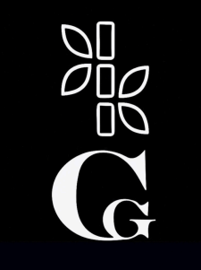
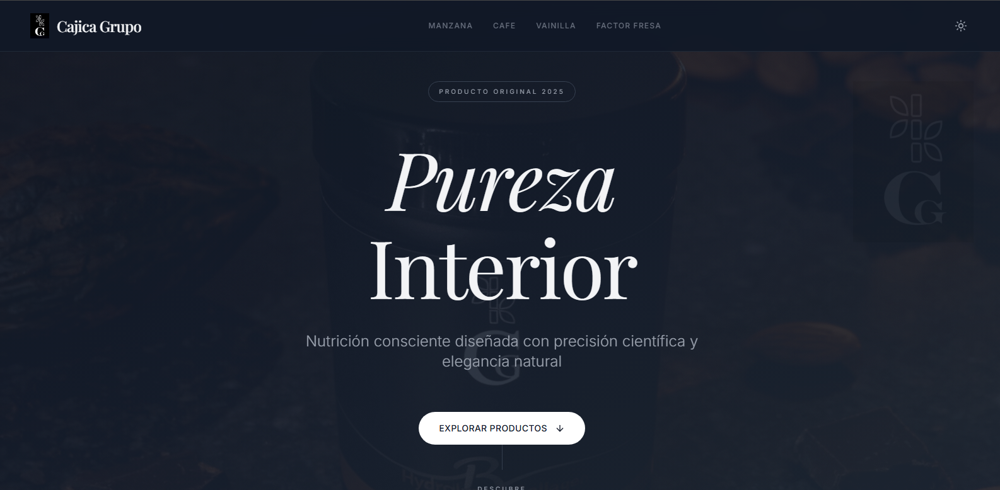

  

<h1 align="center">📘 Catálogo CGP Productos</h1>

  

---

## 🚀 Descripción

Proyecto desarrollado para mostrar el **catálogo oficial de suplementos dietarios de Cajica Grupo (CGP)**.

Diseñado con un enfoque minimalista y profesional.

---

## 🛠️ Tecnologías utilizadas

- **HTML5**
- **CSS3**
- **JavaScript**
- **TailwindCSS**
- Animaciones suaves con CSS y utilidades modernas

---

## 🌐 Deploy en Vercel

El proyecto se puede desplegar fácilmente en **Vercel** para obtener una URL rápida y estable.

---

## 📁 Estructura del proyecto

